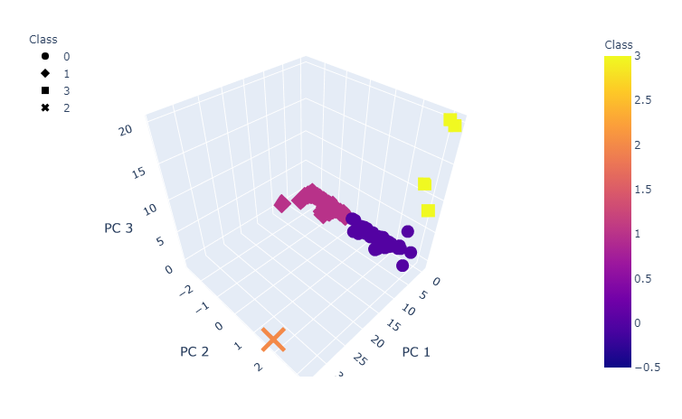

# Cryptocurrency Market Analysis

## Overview:

Using Pandas to apply unsupervised learning methods to report what cryptocurrencies are on the trading market and how they could be grouped to create a classification system for a new investment.

## Purpose:

Using Pandas to apply unsupervised learning methods to analyze crytocurrency data from CryptoCompare.  Task performed included:

1. Preprocessing the data for PCA (Principal Component Analysis)

2. Reducing data dimensions using PCA

3. Clustering crytocurrencies using K-means

4. Visualizing cryptocurrencies results

## Challenges and Difficulties Encountered

-- To achieve Deliverable 1 task to "keep all the cryptocurrencies that have a working algorithm", a check was performed to see if any cryptocurrencies had no algorithm value assigned (blank value).  Since all cryptocurrencies had an algorithm value assigned (no blank values), no crytocurrencies were removed from the dataset.

## Results Summary

** Deliverable 2: Data successfully preprocessed to use the PCA algorithm to reduce the dimensions.

### PCS_DF DataFrame using Crypto_df DataFrame Index

** Deliverable 3: Elbow curve created, predictions made on the K = 4 clusters to create the new crypto_df dataframe with nine columns

### Elbow Curve

### Crypto_df DataFrame

** Deliverable 4: Clusters plotted on 3-D scatter plot, a new dataframe created with the scaled data, and a scatter plot created for TotalCoinsMined and TotalCoinSupply.

### 3-D Scatter Plot

### DataFrame with Scaled Data

### Scatter Plot "TotalCoinsMined" and "TotalCoinSupply"

